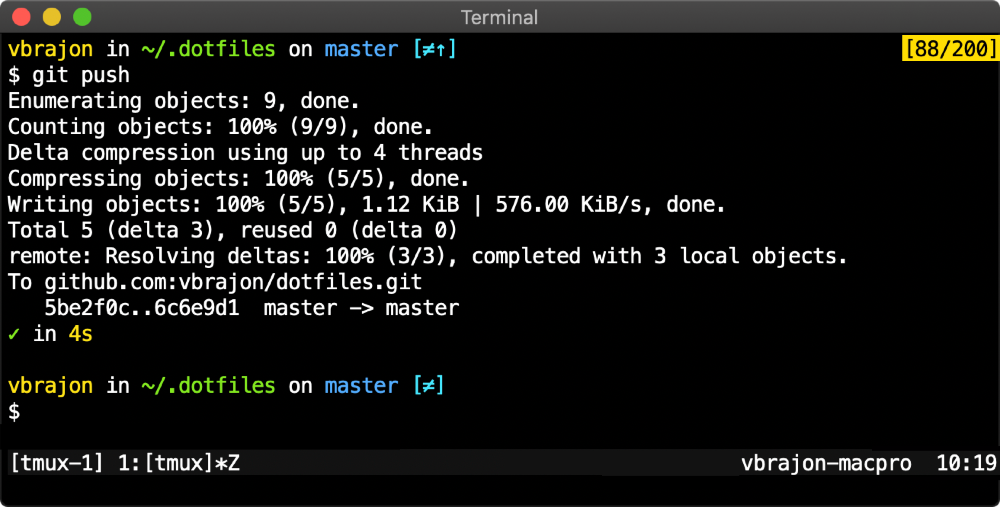

# Valentin's dotfiles



## Installation

```bash
bash <(curl -SsL https://vbrajon.github.io/dotfiles/dotfiles.sh)
```

⚠️ Windows experimental install, command to run in **powershell** as **ADMIN**

```bash
iex ((New-Object System.Net.WebClient).DownloadString('https://vbrajon.github.io/dotfiles/dotfiles.ps1'))
```

📦 On a server, you may want to install only bash prompt and shortcuts

```bash
mv ~/.bash_profile ~/.bashrc /tmp
curl -s https://raw.githubusercontent.com/vbrajon/dotfiles/master/.bash_prompt >> ~/.bash_profile
curl -s https://raw.githubusercontent.com/vbrajon/dotfiles/master/.bash_shortcuts >> ~/.bash_profile
curl -s https://raw.githubusercontent.com/rupa/z/master/z.sh >> ~/.bash_profile
```

## What's inside

- [x] [setup script](dotfiles.sh)
- [x] [bash prompt](.bash_prompt) + timer + completion
- [x] [bash aliases and functions](.bash_shortcuts)
- [x] [git aliases and config](.gitconfig)
- [x] [git hooks](.githooks)
- [x] [tmux config](.tmux.conf) + shared history

❤️ Thanks [mathiasbynens](https://github.com/mathiasbynens/dotfiles), [paulirish](https://github.com/paulirish/dotfiles) and [open-source](https://github.com/search?q=bash&s=stars) in the 🌍.
